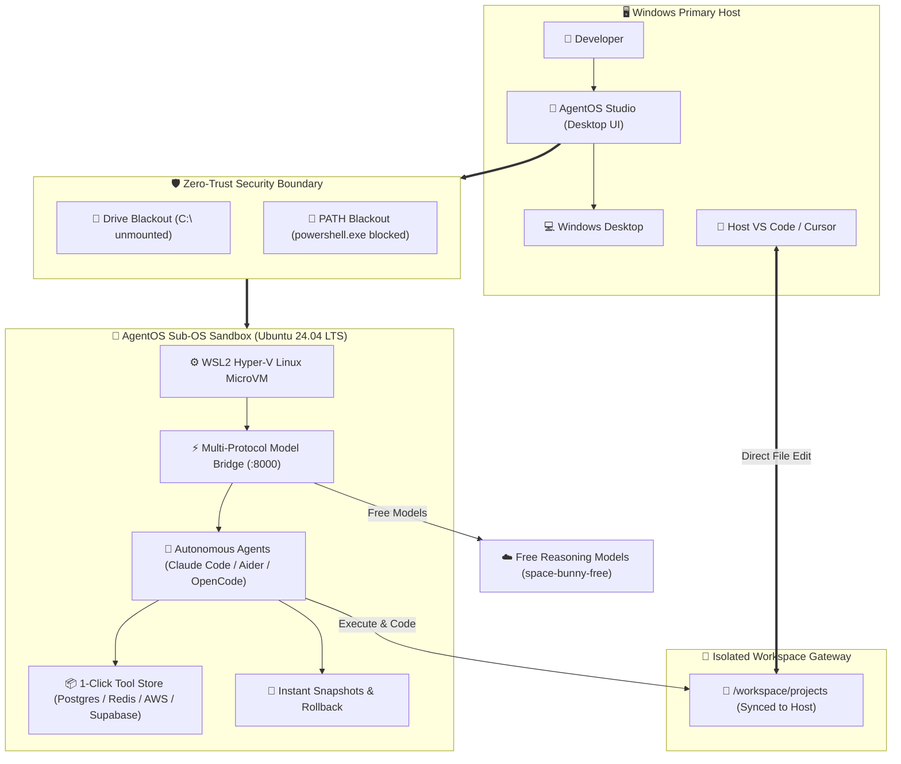
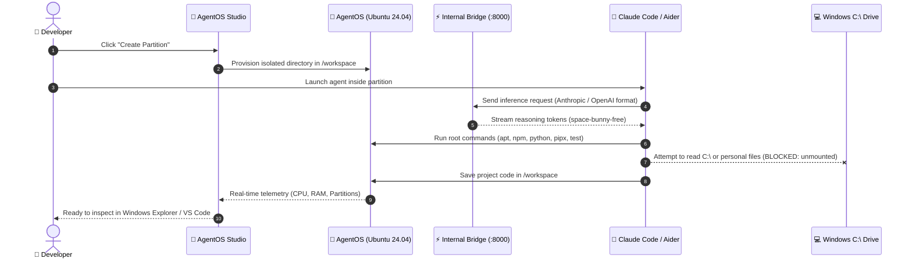

# AgentOS Studio 🤖🛡️

> **The Sandboxed Sub-Operating System & Apple-Polished Desktop Studio for Autonomous AI Coding Agents**

<p align="center">
  
</p>

<p align="center">
  <a href="LICENSE"></a>
  <a href="https://microsoft.com/windows"></a>
  <a href="https://electronjs.org"></a>
  <a href="#-refined-apple-ios--macos-design"></a>
  <a href="#-the-zero-trust-security-firewall"></a>
</p>

---

## 📸 Desktop Application Walkthrough

### 1. System Health & Security Dashboard
Apple iOS dark theme featuring organic dark oval background depth, crisp white buttons, and the iconic Apple Action Orange CTA button.
<p align="center">
  
</p>

### 2. 1-Click Developer Tool Store
Install databases, cloud CLIs, and container engines directly into the isolated sandbox without polluting your Windows registry.
<p align="center">
  
</p>

### 3. Console Runner & Sandbox Terminal
Execute commands as a standard user or with passwordless root (`sudo`) with instant preset chips.
<p align="center">
  
</p>

---

## 🌟 What is AgentOS Studio?

**AgentOS Studio** gives autonomous AI coding agents (such as **Claude Code**, **Aider**, **OpenCode**, and custom agent frameworks) a dedicated, sandboxed **Sub-Operating System** (Ubuntu 24.04 LTS running via a hardware-isolated Hyper-V WSL2 microVM) paired with a desktop studio interface designed to Apple's Human Interface Guidelines.

### Why does it exist?
Giving autonomous AI agents raw terminal access to your primary operating system is hazardous:
* An agent can run `rm -rf /` or delete critical files.
* An agent can inspect private directories, SSH keys, browser cookies, and host credentials.
* Agents often install incompatible system packages that break your host environment.

**AgentOS Studio creates an airtight sandbox:**
* **Host Drive Blackout (`automount = false`):** Your host `C:\` and `D:\` drives are completely unmounted and invisible.
* **Windows Binary Blocking (`appendWindowsPath = false`):** Windows executables (`powershell.exe`, `cmd.exe`) are stripped from Linux PATH, preventing escape.
* **Shared Workspace Gateway:** Only the project directory (`/workspace`) is shared and synced to your Windows machine.

---

## 📊 Interactive System Architecture



---

## 🔄 Agent Execution & Safety Flow



---

## 🎨 Refined Apple iOS & macOS Design

AgentOS Studio was specifically styled to avoid generic "AI slop" (no cheap neon purple gradients, no cluttered cyber badges). Instead, it adopts **Apple Human Interface Guidelines (HIG)**:
* **Dark Oval Background Depth:** Multi-layered, organic elliptical dark ambient gradients that create smooth depth.
* **Crisp White Buttons:** Standard, navigation, and utility controls are styled as clean, solid Apple White pill buttons with high-contrast text and spring-physics press states.
* **Apple Action Orange Buttons:** High-impact CTA buttons (*"New Partition"*, *"Execute"*, *"Take Snapshot"*, *"Run Prompt"*) use iconic Apple Action Orange (`#FF9500` / `#FF9F0A`).
* **Frosted Liquid Glass Materials:** Translucent cards with `backdrop-filter: blur(40px) saturate(190%)` and delicate hairline borders with top-edge light refraction.

---

## 🤖 Supported & Verified CLI Agents

AgentOS Studio comes pre-configured with popular AI coding agents, verified to run inside the sandbox using free or custom models:

| CLI Agent | Version | Protocol | Status | Capabilities |
| :--- | :--- | :--- | :--- | :--- |
| **Claude Code** (`claude`) | `2.1.283` | Anthropic Messages SSE | ✅ **Verified** | Reads codebase, generates ASCII diagrams, edits Markdown & JSON, creates files |
| **Aider** (`aider`) | `0.86.2` | OpenAI Chat Completions | ✅ **Verified** | Applies unified diffs, writes Python code, multi-turn reasoning |
| **OpenCode CLI** (`opencode`) | `1.18.32` | Native OpenCode Protocol | ✅ **Verified** | Interactive terminal TUI and CLI execution |

### Built-in Multi-Protocol Model Bridge
AgentOS includes an internal daemon (`opencode-bridge.js`) running on `http://127.0.0.1:8000`:
* Accepts standard **OpenAI `/v1/chat/completions`** requests.
* Accepts native **Anthropic `/v1/messages`** streaming requests with thinking tokens.
* Routes requests through OpenCode's infrastructure to free models like `space-bunny-free`.

---

## 🎛️ Features & Capabilities

1. **System Health & Security Dashboard:**
   - Real-time kernel status, RAM consumption, and virtual disk size.
   - Live Host Protection Shield confirming drive blackout.
2. **Visual Application Partitions:**
   - Create sandboxed development partitions with 1 click (Python 3.12, Node.js 22 LTS, Fullstack, or Blank).
   - Instant launch into VS Code or Windows Explorer.
3. **1-Click Developer Tool Store:**
   - Install CLI tools directly into the isolated sandbox without polluting Windows: AWS CLI v2, Supabase CLI, Stripe CLI, Redis, PostgreSQL, and Podman/Docker.
4. **Console Runner & Sandbox Terminal:**
   - Execute commands directly inside the sub-OS as a standard user or with passwordless root (`sudo`).
   - Quick command chips for instant health checks and diagnostics.
5. **Safety Snapshots & Rollback:**
   - Take instant point-in-time snapshots before testing untrusted code.
   - Roll back to a clean state with 1 click if an agent breaks something.

---

## ⚡ Quickstart & 1-Command Installation

### Prerequisites
* Windows 10 (Build 19041+) or Windows 11
* WSL2 enabled (Virtual Machine Platform)

### One-Command Setup
Open PowerShell as Administrator and run:
```powershell
irm https://raw.githubusercontent.com/Developer-For-Git/AgentOS-Studio/main/install.ps1 | iex
```

### Manual Setup
1. Clone the repository:
   ```bash
   git clone https://github.com/Developer-For-Git/AgentOS-Studio.git
   cd AgentOS-Studio
   ```
2. Copy the environment template:
   ```bash
   cp .env.example .env
   # Add your OpenCode API key if using the free model bridge
   ```
3. Launch the desktop studio:
   ```bash
   cd desktop
   npm install
   npm start
   ```

---

## 🛡️ Security Architecture

```
+-------------------------------------------------------------+
|                     HOST WINDOWS PC                         |
|  [Personal Files] [Desktop] [Browser Data] [C:\ System]     |
|                              |                              |
|                   ❌ HARDWARE BARRIER ❌                    |
|      (automount=false | appendWindowsPath=false)            |
|                              |                              |
|  +---------------------------v---------------------------+  |
|  |                 AGENTOS SANDBOX (WSL2)                |  |
|  |  • Ubuntu 24.04 LTS (Isolated Virtual Disk ext4.vhdx) |  |
|  |  • Full root/sudo rights for AI agent                 |  |
|  |  • Pre-installed: Python 3.12, Node 22, Claude, Aider |  |
|  |  • Internal Bridge: http://127.0.0.1:8000             |  |
|  |  • Shared Gateway: Only /workspace is mounted        |  |
|  +-------------------------------------------------------+  |
+-------------------------------------------------------------+
```

---

## 🤝 Contributing

Contributions are warmly welcomed! Please see our contribution guidelines:
1. Fork the Project.
2. Create your Feature Branch (`git checkout -b feature/AmazingFeature`).
3. Commit your Changes (`git commit -m 'Add some AmazingFeature'`).
4. Push to the Branch (`git push origin feature/AmazingFeature`).
5. Open a Pull Request.

---

## 📄 License

Distributed under the **MIT License**. See [LICENSE](LICENSE) for more information.
