# AgentOS Studio 🤖🛡️

> **The Sandboxed Sub-Operating System & Apple-Polished Desktop Studio for Autonomous AI Coding Agents**

<p align="center">
  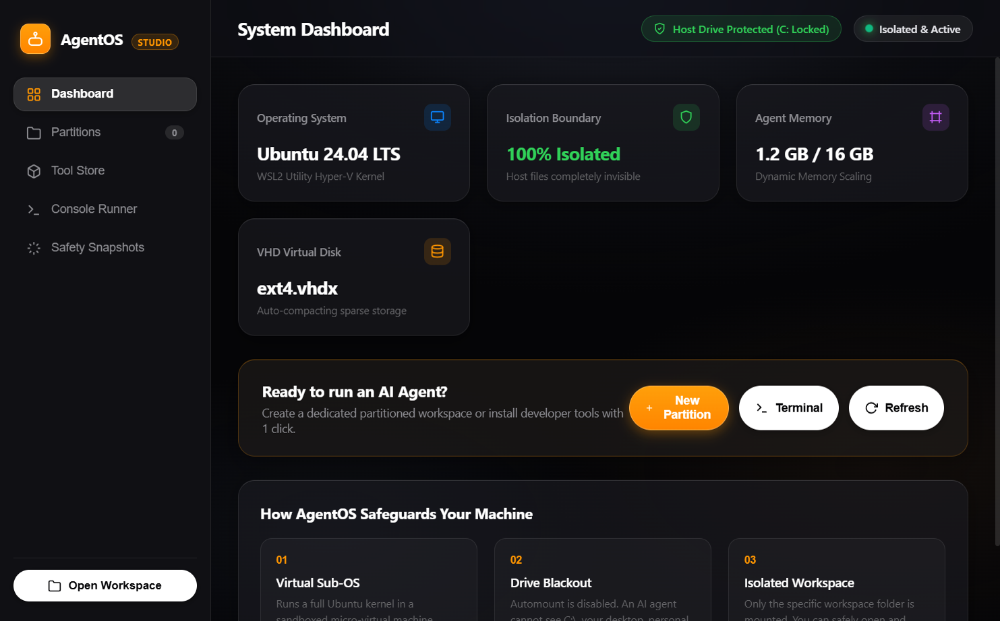
</p>

<p align="center">
  <a href="#-1-click--1-command-installation-available-"></a>
  <a href="#-project-status--active-beta"></a>
  <a href="#-license--open-source-philosophy"></a>
  <a href="https://microsoft.com/windows"></a>
  <a href="https://electronjs.org"></a>
  <a href="#-refined-apple-ios--macos-design"></a>
  <a href="#-the-zero-trust-security-firewall"></a>
</p>

> [!IMPORTANT]
> ### 🚧 Project Status: Active Beta & Community Feedback Driven
> **AgentOS Studio is in active, rapid development and is not yet a frozen 1.0 release.**
> We are actively configuring subsystems, testing tool chains, adding new integrations (MCP servers, skills, graph tools), hardening isolation boundaries, and fixing bugs.
>
> 💡 **Community Feedback Accelerates Development:** The more developers use AgentOS, run autonomous coding agents in it, and share their real-world workflows, the faster we can fix edge cases, polish features, and expand the platform. If you encounter any bugs, have feature requests, or want support for specific AI agents and CLI tools, please **[open an Issue](https://github.com/Developer-For-Git/AgentOS-Studio/issues)** or submit a Pull Request!

---

## ⚡ 1-Click / 1-Command Installation: **Available ✅**

Yes! **A 1-Click / 1-Command automated installer is fully available** for Windows. You do not need to manually configure WSL2, create partitions, or write hardware isolation rules by hand.

### 🚀 Instant Setup (1-Command in PowerShell)
Open **PowerShell as Administrator** (Right-click Windows Start Menu → *Terminal (Admin)* or *PowerShell (Admin)*) and run:

```powershell
irm https://raw.githubusercontent.com/Developer-For-Git/AgentOS-Studio/main/install.ps1 | iex
```

### ⚙️ What the 1-Click Installer Does Automatically:
1. 🔍 **Verifies WSL2 & Virtualization:** Checks if WSL2 is enabled; if not, triggers automatic installation.
2. 📦 **Fetches Repository:** Clones or downloads the complete AgentOS Studio codebase.
3. 🐧 **Sets Up Sandboxed Sub-OS:** Downloads Ubuntu 24.04 LTS rootfs and imports the isolated `AgentOS` microVM.
4. 🛡️ **Applies Zero-Trust Hardware Barrier:** Writes `/etc/wsl.conf` with `automount=false` and `appendWindowsPath=false`, unmounting the host `C:\` drive completely.
5. 📂 **Mounts Secure Gateway:** Bridges only the `/workspace` folder for safe agent file generation.
6. 💻 **Installs GUI Dependencies:** Sets up Node.js LTS and Electron Studio packages.
7. 🖥️ **Creates Desktop Shortcut & Launches:** Places an **`AgentOS`** shortcut on your Windows desktop and launches the studio automatically!

---

### 📋 Prerequisites
* **Windows 10 (Build 19041+)** or **Windows 11** (64-bit).
* **Virtualization enabled** in your motherboard BIOS/UEFI (SVM / Intel VT-x).
* **Internet Connection** for the initial Ubuntu rootfs and npm package setup.

---

### 🛠️ Option B: Step-by-Step Manual Setup (For Advanced Developers)

#### Step 1: Clone the Repository
```powershell
git clone https://github.com/Developer-For-Git/AgentOS-Studio.git
cd AgentOS-Studio
```

#### Step 2: Configure Environment & Free Model Provider
```powershell
Copy-Item .env.example .env
# Edit .env to set your preferred free model provider key or custom OpenAI/Anthropic endpoint
```

#### Step 3: Initialize the AgentOS Sub-OS Sandbox
```powershell
# In PowerShell (Administrator):
wsl --import AgentOS ./wsl-distro/install-root ./wsl-distro/ubuntu-rootfs.tar.gz --version 2
# Or run the included provisioning script:
.\scripts\setup-agentos-wsl.ps1
```

#### Step 4: Install Dependencies & Launch Desktop Studio
```powershell
cd desktop
npm install
npm start
```

---

### 🔌 Connecting Your IDEs & Autonomous Agents

Once the desktop studio is open, you can immediately connect your favorite tools:
* **Cursor & Cursor Pro:** Open `workspace/projects/<partition-name>`. Terminal sessions and AI composer tools run inside the sandboxed sub-OS while editing files natively on Windows.
* **Google Antigravity IDE:** Point workspace root to `workspace/projects/<partition-name>`. DeepMind agentic pairing runs directly within the hardware-isolated microVM.
* **VS Code:** Run `code workspace/projects/<partition-name>` or launch via the 1-click launcher inside the **Partitions** tab.
* **Antigravity CLI (`agy`), Claude Code, Aider, Kilo Code:** Run agents inside the **Console Runner** tab or in the sub-OS terminal with free reasoning models routed through `http://127.0.0.1:8000`.

---

## 🧠 Obsidian Knowledge Graph & External Second Brain Bridges

AgentOS includes a **Secondary Project Brain** equipped with an interactive knowledge graph engine modeled after Obsidian's graph view, plus connectors for your favorite knowledge tools.

<p align="center">
  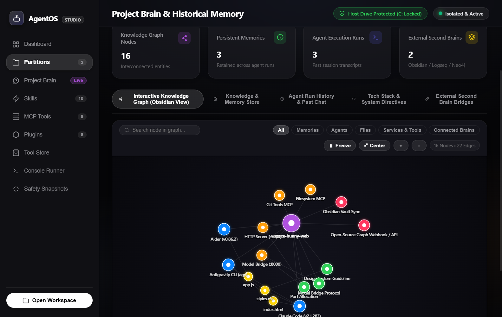
</p>

### Key Capabilities:
* **Interactive 60fps Force-Directed Physics Graph:** Nodes represent Partitions, Persistent Memories, Past Agent Execution Runs, Source Files, Sub-OS Services, and External Tools. Built with Coulomb repulsion, Hooke spring attraction, center gravity, and smooth damping.
* **Glowing Hover & Wikilink Highlighting:** Hover over any node to highlight its connected dependencies and dim unrelated items.
* **Floating Node Inspector HUD:** Click any node to inspect its category, detailed content, connected bidirectional `[[wikilinks]]`, and jump straight to the source note or agent transcript.
* **Search & Filter Controls:** Filter by *Memories*, *Agents*, *Files*, *Services*, or *Connected Brains*, or search in real time with auto-zoom focusing.
* **1-Click Obsidian Vault Exporter:** Compiles partition knowledge into standard Markdown notes with frontmatter, `[[wikilinks]]`, and a ready-to-use `.obsidian/graph.json` configuration. Open `/workspace/projects/<partition>/.agentos/obsidian` directly in the Obsidian desktop application!

<p align="center">
  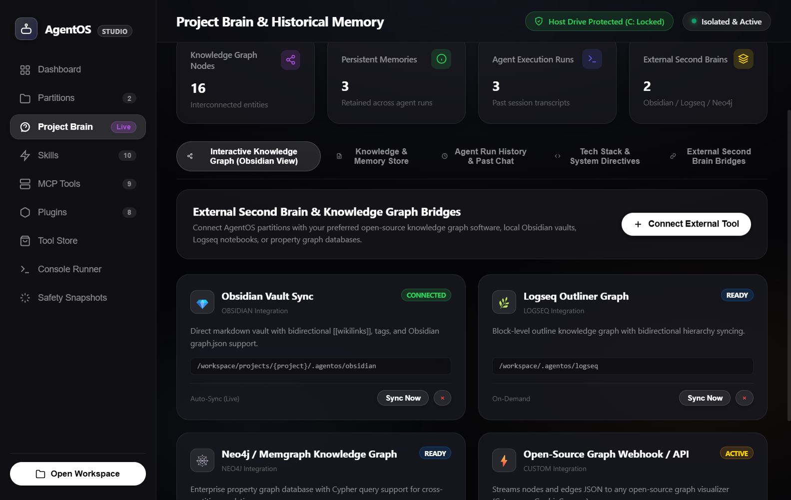
</p>

### 🌉 Connect External Second Brain Tools:
AgentOS can bridge project knowledge directly with third-party tools and graph engines:
1. **Obsidian Vault Sync:** Direct bidirectional sync with your local Obsidian vault (`.agentos/obsidian`).
2. **Logseq Outliner Graph:** Block-level outline knowledge graph with bidirectional hierarchy syncing (`.agentos/logseq`).
3. **Neo4j / Memgraph Property Graph DB:** Enterprise property graph database with Cypher query support for advanced cross-project relations.
4. **Open-Source Graph Webhooks & APIs:** Stream nodes and edges JSON to any open-source graph visualizer (such as Cytoscape, Gephi, Cosmos, or custom webhooks).
5. **Custom Connector Modal:** Add your own HTTP REST endpoints, webhook URLs, and file-watcher pipelines with 1 click.

---

## 📸 Desktop Application Walkthrough

### 1. System Health & Security Dashboard
Apple iOS dark theme featuring organic dark oval background depth, crisp white buttons, and the iconic Apple Action Orange CTA button.
<p align="center">
  
</p>

### 2. Isolated Application Partitions
Manage project micro-environments with dedicated virtual environments, Git roots, and 1-click launchers for Cursor Pro, Antigravity IDE, VS Code, and Explorer.
<p align="center">
  
</p>

### 3. Project Brain: Obsidian Knowledge Graph View
Interactive force-directed graph view linking memories, agent conversation transcripts, files, and background tools.
<p align="center">
  
</p>

### 4. External Second Brain & Graph Bridges
Connect with Obsidian, Logseq, Neo4j, or open-source graph visualizers and webhooks.
<p align="center">
  
</p>

### 5. Autonomous Agent Skills Suite & skills.sh Live Registry
Equip agents with **30+ verified development skills** across 9 domains (Frontend, Backend, Testing, Security, DevOps, Database & RAG, Architecture, Automation) plus **24+ community skills** via the live `skills.sh` registry:
- **Interactive Category Switching:** 9 category pills (`Frontend`, `Backend`, `Testing`, `Security`, `DevOps`, `Database`, `Architecture`, `Automation`) with live item counts for instant switching.
- **Direct Skill Fetcher:** Click **Fetch Skill** to import custom skills from any URL, Git repository (`https://github.com/...`), or package identifier (`@skills-sh/...`).
- **Batch Authorization Controls:** 1-click `✓ Enable All` and `⊘ Disable All` per category with granular per-project authorization chips.
<p align="center">
  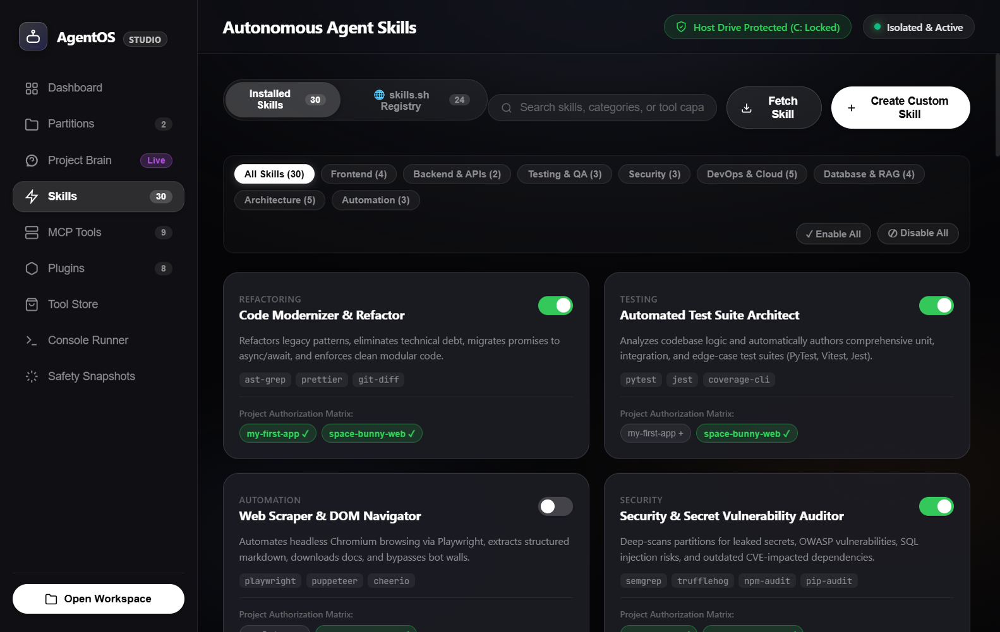
</p>
<p align="center">
  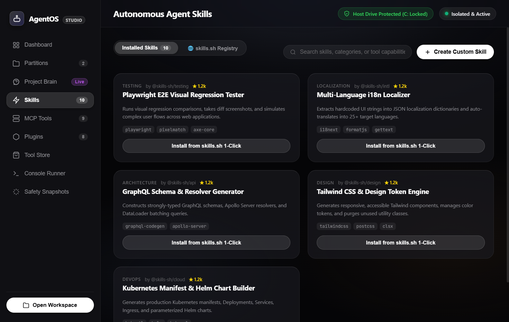
</p>

### 6. Model Context Protocol (MCP) Hub & Project Authorization Matrix
Configure local and remote MCP tool servers with zero host escape. Granular matrix controls let you toggle `Full Access`, `Read Only`, or `Blocked` per partition.
<p align="center">
  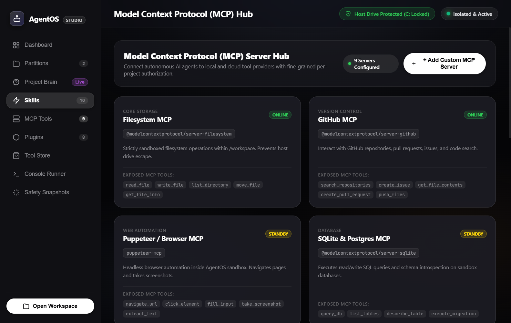
</p>
<p align="center">
  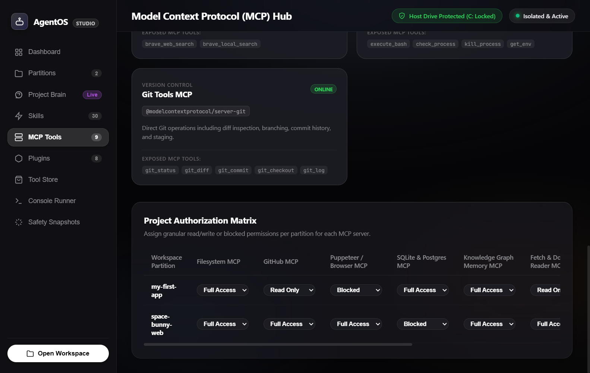
</p>

### 7. Runtime Extensions & Background Sidecars
Equip AI agents with live security masking, automatic pre-execution snapshots, hot-reload preview listeners, and inference telemetry.
<p align="center">
  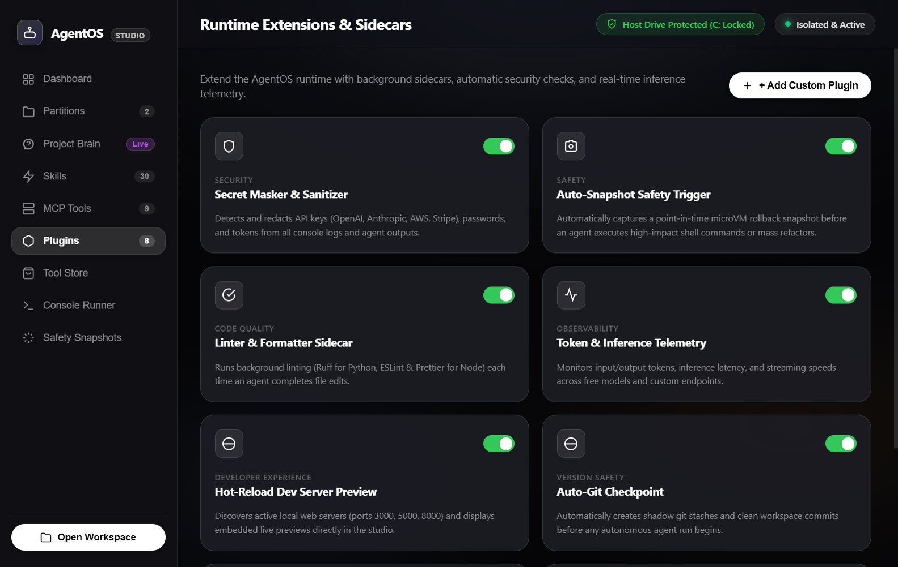
</p>

### 8. 1-Click Developer Tool Store
Install databases, cloud CLIs, and container engines directly into the isolated sandbox without polluting your Windows registry.
<p align="center">
  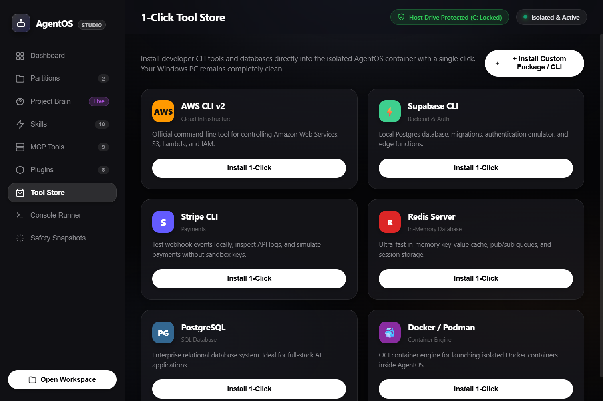
</p>

### 9. Console Runner & Sandbox Terminal
Execute commands as a standard user or with passwordless root (`sudo`) with instant preset chips.
<p align="center">
  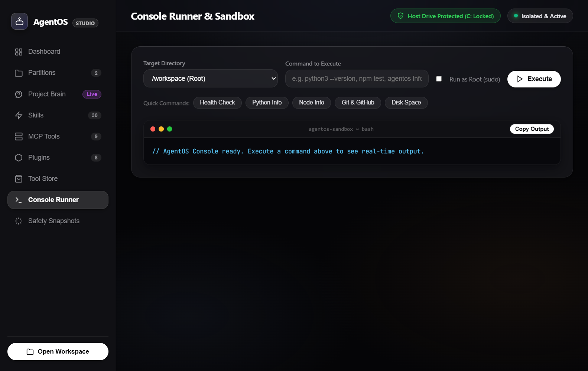
</p>

---

## 🌟 What is AgentOS Studio?

**AgentOS Studio** gives autonomous AI coding agents (such as **Antigravity CLI (`agy`)**, **Claude Code**, **Aider**, **Kilo Code CLI**, **OpenCode**) and modern AI code editors (such as **Cursor**, **Cursor Pro**, **Google Antigravity IDE**, **Kilo Code**, **VS Code**) a dedicated, sandboxed **Sub-Operating System** (Ubuntu 24.04 LTS running via a hardware-isolated Hyper-V WSL2 microVM) paired with a desktop studio interface designed to Apple's Human Interface Guidelines.

### Why does it exist?
Giving autonomous AI agents raw terminal access to your primary operating system is hazardous:
* An agent can run `rm -rf /` or delete critical files.
* An agent can inspect private directories, SSH keys, browser cookies, and host credentials.
* Agents often install incompatible system packages that break your host environment.

**AgentOS Studio creates an airtight sandbox:**
* **Host Drive Blackout (`automount = false`):** Your host `C:\` and `D:\` drives are completely unmounted and invisible.
* **Windows Binary Blocking (`appendWindowsPath = false`):** Windows executables (`powershell.exe`, `cmd.exe`) are stripped from Linux PATH, preventing escape.
* **Shared Workspace Gateway:** Only the project directory (`/workspace`) is shared and synced to your Windows machine.

---

## 📊 Interactive System Architecture

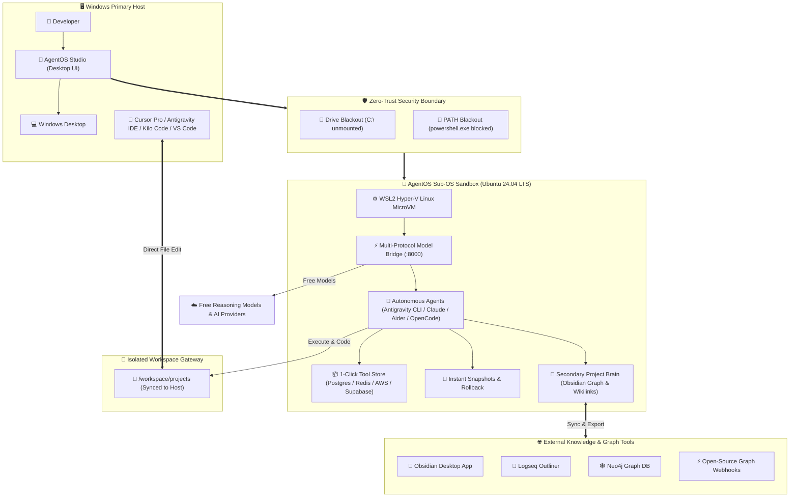

---

## 🔄 Agent Execution & Safety Flow

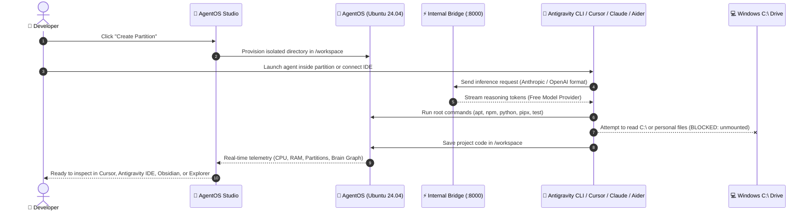

---

## 🎨 Refined Apple iOS & macOS Design

AgentOS Studio was specifically styled to avoid generic "AI slop" (no cheap neon purple gradients, no cluttered cyber badges). Instead, it adopts **Apple Human Interface Guidelines (HIG)**:
* **Dark Oval Background Depth:** Multi-layered, organic elliptical dark ambient gradients that create smooth depth.
* **Crisp White Buttons:** Standard, navigation, and utility controls are styled as clean, solid Apple White pill buttons with high-contrast text and spring-physics press states.
* **Apple Action Orange Buttons:** High-impact CTA buttons (*"New Partition"*, *"Execute"*, *"Take Snapshot"*, *"Run Prompt"*) use iconic Apple Action Orange (`#FF9500` / `#FF9F0A`).
* **Frosted Liquid Glass Materials:** Translucent cards with `backdrop-filter: blur(40px) saturate(190%)` and delicate hairline borders with top-edge light refraction.

---

## 💻 Supported AI-Native IDEs & Editors

AgentOS Studio is engineered to work seamlessly with the world's leading AI-first IDEs and code editors. Developers can write code on Windows in their favorite editor while all background agents, terminal actions, and builds run safely inside the isolated sub-OS:

| Editor / IDE | Compatibility | Integration Mode | Features |
| :--- | :--- | :--- | :--- |
| **Cursor & Cursor Pro** | ✅ **Native** | Direct `/workspace` mount + Bridge | Full agentic Composer, terminal execution isolated in AgentOS, zero access to Windows host files |
| **Google Antigravity IDE** | ✅ **Native** | Direct `/workspace` mount + Multi-Agent | Autonomous agent pairing, multi-agent planning, background execution in sub-OS microVM |
| **Kilo Code** | ✅ **Native** | Workspace mount + API Bridge | Local and remote agent workflows, zero-trust filesystem isolation |
| **VS Code** | ✅ **Native** | Dev Containers / Remote-WSL / Direct Mount | Compatible with GitHub Copilot, Cline, Roo Code, and Continue extensions |

---

## 🤖 Supported & Verified CLI Agents

AgentOS Studio comes pre-configured with popular autonomous AI coding agents, verified to run inside the sandbox using **any free model provider**, local models, or custom AI endpoints:

| CLI Agent | Version | Protocol | Status | Capabilities |
| :--- | :--- | :--- | :--- | :--- |
| **Antigravity CLI** (`agy`) | `Latest` | Multi-Agent / SSE | ✅ **Verified** | Google DeepMind agentic CLI for multi-agent coordination, automated project refactors, and terminal tasks |
| **Claude Code** (`claude`) | `2.1.283` | Anthropic Messages SSE | ✅ **Verified** | Reads codebase, generates ASCII architecture, edits Markdown & JSON, creates files |
| **Aider** (`aider`) | `0.86.2` | OpenAI Chat Completions | ✅ **Verified** | Applies unified diffs, writes Python/Node code, multi-turn reasoning loops |
| **Kilo Code CLI** (`kilocode`) | `Latest` | OpenAI / Anthropic API | ✅ **Verified** | Headless CLI agent runner for unattended tasks |
| **OpenCode CLI** (`opencode`) | `1.18.32` | Native OpenCode Protocol | ✅ **Verified** | Interactive terminal TUI and CLI execution |

### ⚡ Built-in Multi-Protocol Model Bridge
AgentOS includes an internal daemon (`scripts/opencode-bridge.js`) running on `http://127.0.0.1:8000`:
* Accepts standard **OpenAI `/v1/chat/completions`** requests.
* Accepts native **Anthropic `/v1/messages`** streaming requests with thinking tokens.
* **Universal Model Compatibility:** Routes requests to unlimited free models from your preferred model provider, local LLMs (Ollama / vLLM), or custom OpenAI-compatible endpoints with zero configuration required.

---

## 🛡️ Security Architecture

```
+-------------------------------------------------------------+
|                     HOST WINDOWS PC                         |
|  [Personal Files] [Desktop] [Browser Data] [C:\ System]     |
|                              |                              |
|                   ❌ HARDWARE BARRIER ❌                    |
|      (automount=false | appendWindowsPath=false)            |
|                              |                              |
|  +---------------------------v---------------------------+  |
|  |                 AGENTOS SANDBOX (WSL2)                |  |
|  |  • Ubuntu 24.04 LTS (Isolated Virtual Disk ext4.vhdx) |  |
|  |  • Full root/sudo rights for AI agent                 |  |
|  |  • Pre-installed: Python 3.12, Node 22, Claude, Aider |  |
|  |  • Internal Bridge: http://127.0.0.1:8000             |  |
|  |  • Shared Gateway: Only /workspace is mounted        |  |
|  +-------------------------------------------------------+  |
+-------------------------------------------------------------+
```

---

## 🤝 Contributing

## 🤝 Contributing & Community Roadmap
AgentOS Studio thrives on open-source community collaboration! Because the project is in **Active Beta**, we actively review and merge community improvements:
1. **Report Bugs & Edge Cases:** If an agent, partition, or tool behaves unexpectedly, [open an issue](https://github.com/Developer-For-Git/AgentOS-Studio/issues) with reproduction steps.
2. **Suggest Tools & Model Providers:** Request custom MCP servers, new skills, or local LLM engine hooks.
3. **Submit Code Changes:**
   * Fork the repository.
   * Create your Feature Branch (`git checkout -b feature/NewCapability`).
   * Commit your Changes (`git commit -m 'feat: add NewCapability'`).
   * Push to the Branch (`git push origin feature/NewCapability`).
   * Open a Pull Request.

---

## 📄 License & Open-Source Philosophy

AgentOS Studio is published as free and open-source software under the **[MIT License](LICENSE)**.

### ❓ Why the MIT License?
* **100% Free & Unrestricted:** Anyone—individual developers, students, startups, and enterprises—can use, study, and run AgentOS Studio completely free of charge with zero royalties or vendor lock-in.
* **Maximum Developer Freedom:** You have full permission to fork the codebase, modify configurations, add internal security rules, build proprietary plugins, or distribute custom sub-OS distributions.
* **Open & Auditable Security:** A sandboxing operating system for autonomous AI agents must be completely transparent. With the MIT License, every script, firewall rule, and IPC handler is publicly inspectable and auditable.
* **Standard Liability & Warranty Disclaimer:** As an actively developing project, the MIT License includes standard open-source protections that allow rapid prototyping and experimentation without legal friction.
